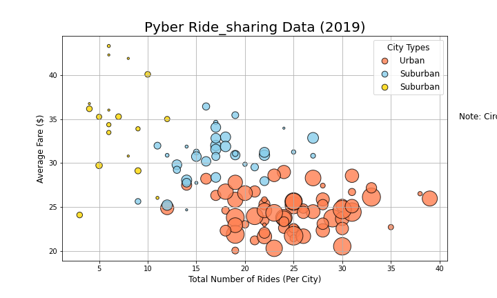
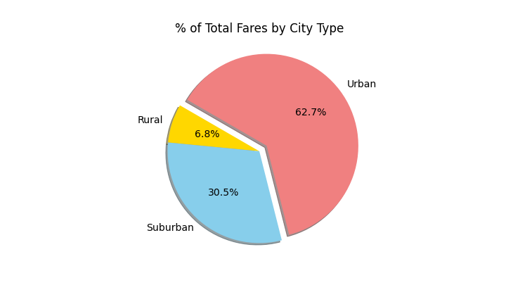
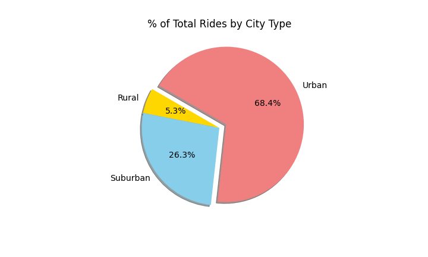
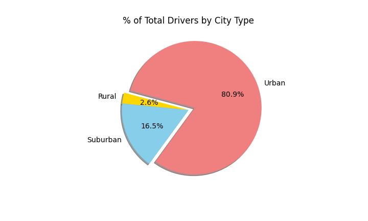
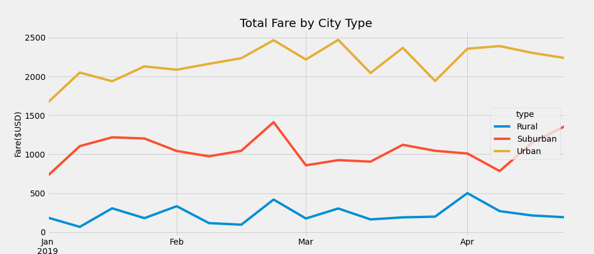

# PyBer_Analysis
The goal with this analysis is to create visualizations using Matplotlib to convey rideshare data to help improve access and determine the affordability of expansion into underserved neighborhoods.

## Project Overview
Using Matplotlib, create multiple visualizations that illustrate business fundamentals for the ride-share company, PyBer.

## Resources
- Data Source: city_data.csv, ride_data.csv, PyBer_ride_data.csv
- Software: Anaconda, Python 3.7.9, Jupyter Notebook, Matplotlib

## Overview
The analysis ran on data gathered between January and early May of 2019. In that timeframe, PyBer was most active in urban areas.

## Results

The median urban areas had four times as many rides (24) than the median rural area (6) and over 40% more than the median suburban area (17).

Whether due to lack of supply, or simply longer distances, the relatively few rural- and suburban-area rides typically had higher average fares.

Further suggesting a lack of supply in suburban and rural communities, the median urban community has 37 drivers, over twice as many as the median suburban community (16) and more than nine times as many as the median rural community (4).

Urban communities account for a majority (62.7% of total) of fares coming into PyBer during this time: over twice what is brought in through suburban communities (30.5% of total), and over nine times what is brought in from rural communities (6.8% of total)

The data are even more extreme when looking at the number of total rides from each community type. Urban communities see their share of rides increase over their share of fares, while rural and suburban communities see their respective shares decline. This reinforces that, while urban rides account for a majority of Pyber fare revenue, it is simply due to the prevalence of rides, each individual ride provides less revenue than its rural and suburban counterparts.

Continuing the trend of data becoming more extreme, while urban communities account for only 62.7% of fares, they comprise over 80% of drivers. Rural communities, by constrast, comprise less than 3%. 

Tracking the fares week-over-week, we see relatively flat revenue from each community type. Urban communities stay within a band from $1500 to $2500; suburban communities, between roughly $750 and $1500; and rural communities, between $0 and $750. One note from this visual: each community sees a local peak in fares in late February.

## Analysis

Simply put, urban communities account for the largest share of fares. This does not, however, mean that they are the best opportunity for expansion. The average rural driver contributes over 3x as much revenue as the average urban driver. Whether this is due to a lack of supply is beyond the scope of this analysis. In order to better ascertain where to expand, data on driver idle time, rider wait times, ride durations, and ride distances may be valuable. From the analysis above, PyBer should consider increases incentives for drivers in rural and suburban communities, in order to increase the number of drivers in those communities.

